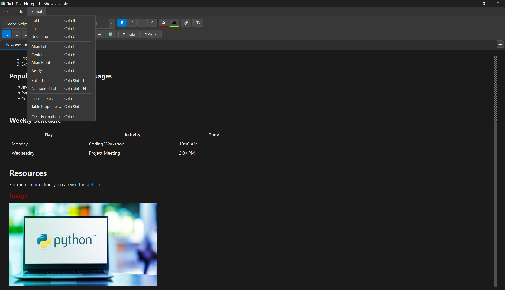
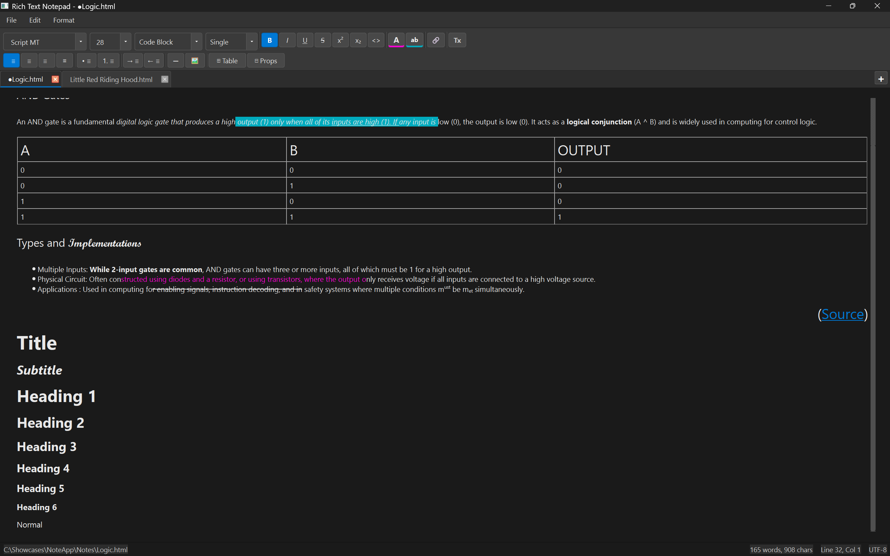
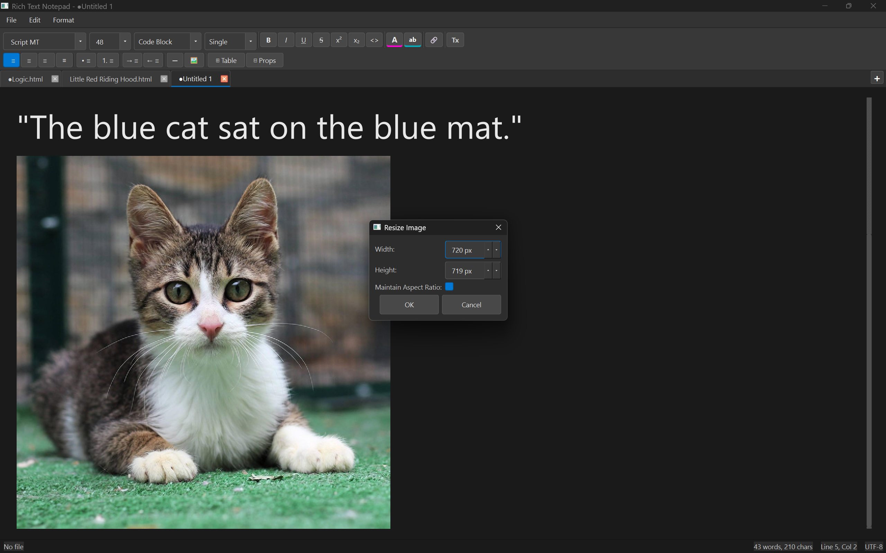
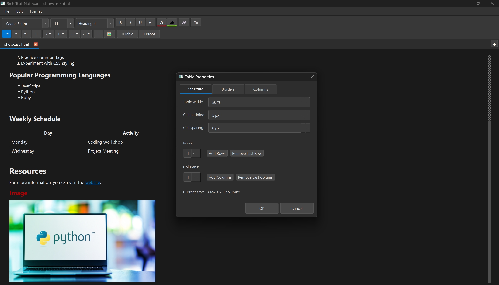
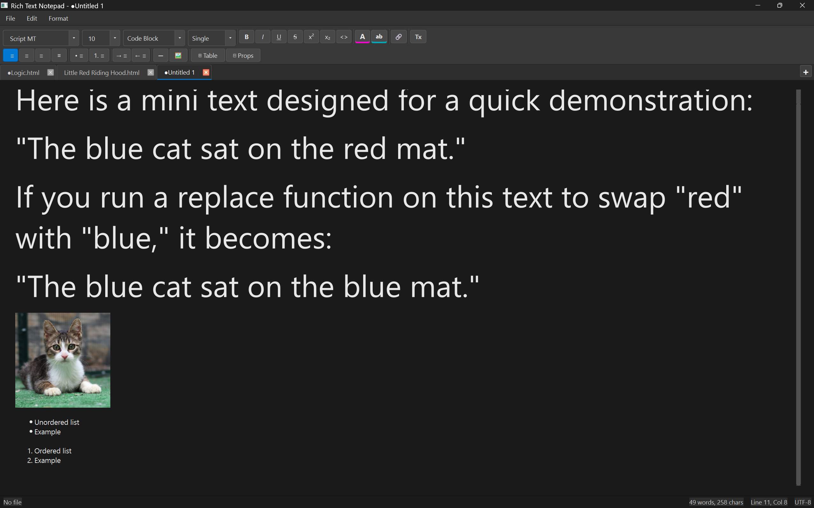
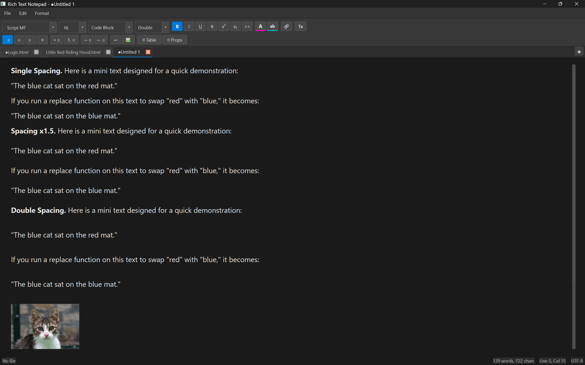
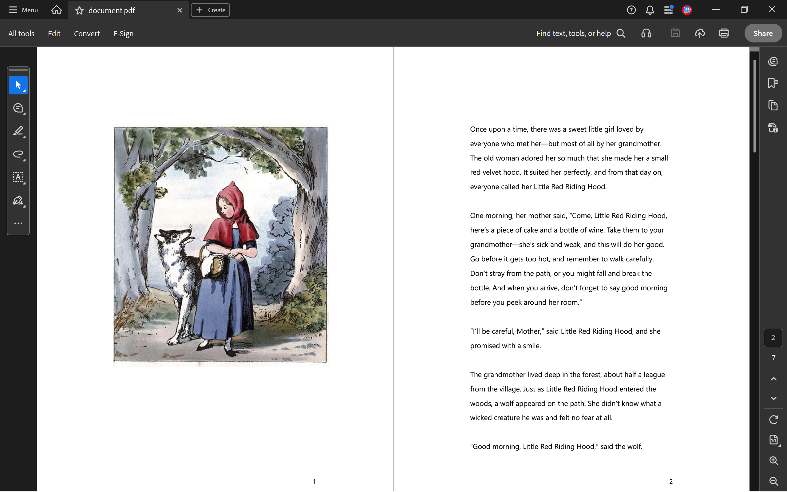

[Français](./README.fr.md) | **English**

# NoteApp

A modular, desktop rich-text editor built with Python and PyQt6, designed to explore how real-world document editors manage state, formatting, and user interaction.

---

## App

[](https://github.com/DerYokoya/NoteApp/releases/tag/v1.1.0)<br>

---

## Video Showcases

### General Showcase
https://github.com/user-attachments/assets/d6096059-27d3-41dd-b621-1abeac8861bb

### Unit Tests
https://github.com/user-attachments/assets/7a42b4c9-5c68-4ed8-b92f-bf14eaff2585

### Persistence / Storage
https://github.com/user-attachments/assets/6be404e3-19c1-41ae-9288-574617280206

### Image Insertion
https://github.com/user-attachments/assets/6841fa4d-eaef-4139-94e4-6eda2a43821c

---

## Images

### Screenshots 
<div align="center">
  <table>
    <tr>
      <td align="center">
        <br />
        <sub><b>Main Window</b></sub>
      </td>
      <td align="center">
        <br />
        <sub><b>Text Formatting</b></sub>
      </td>
      <td align="center">
        <br />
        <sub><b>Headings</b></sub>
      </td>
    </tr>
    <tr>
      <td align="center">
        <br />
        <sub><b>Resize Image</b></sub>
      </td>
      <td align="center">
        <br />
        <sub><b>Table Formatting</b></sub>
      </td>
      <td align="center">
        <br />
        <sub><b>Search Bar</b></sub>
      </td>
    </tr>
    <tr>
      <td align="center">
        <br />
        <sub><b>Lists</b></sub>
      </td>
      <td align="center">
        <br />
        <sub><b>Line Spacing</b></sub>
      </td>
      <td align="center">
        <br />
        <sub><b>PDF Export</b></sub>
      </td>
    </tr>
  </table>
</div>

---

## Overview

NoteApp is a feature-rich desktop editor that supports multi-document workflows, structured content (tables, images), and persistent sessions.

The goal of this project was not just to replicate common editor features, but to **design a system that handles document state, formatting consistency, and user interaction at scale**.

---

## Architecture

The application is structured around separation of concerns between UI, document state, and persistence:

- **UI Layer (MainWindow / Controllers / Widgets)**
  - `MainWindow` handles layout, tab management, file I/O, search/replace, and print/PDF
  - Formatting operations are delegated to `FormattingController`
  - Toolbar construction and theming are delegated to `ToolbarController`
  - Right-click context menus are delegated to `ContextMenuController`
  - Custom widgets: SearchBar, StatusBarWidget, TablePropertiesDialog

- **Editor / Document Layer**
  - Manages text state, cursor behavior, and formatting operations
  - Encapsulates each document per tab for isolation

- **Persistence Layer**
  - Handles saving/loading documents (HTML and TXT)
  - Ensures formatting is preserved across sessions

- **Session Manager**
  - Stores open tabs and restores them on launch
  - Maintains continuity across application restarts

---

## Key Technical Decisions

- **HTML as storage format**
  - Chosen to preserve rich text, images, and structure without designing a custom format

- **Multi-tab document model**
  - Each tab maintains independent state to avoid cross-document interference

- **Controller pattern for MainWindow**
  - `MainWindow` was previously 2000+ lines; formatting logic, toolbar construction, and context menu logic have been extracted into dedicated controllers, making each concern independently testable and easier to extend

- **Local-first design**
  - No external dependencies or cloud integration, which ensures performance and reliability

- **PyQt6 for UI**
  - Enables fine-grained control over desktop interactions and complex widgets

---

## Challenges & Solutions

- **Rich text consistency**
  - Managing overlapping styles (bold, headings, colors) without conflicts required careful formatting control

- **Dynamic table manipulation**
  - Supporting row/column updates and styling without breaking layout integrity

- **Session persistence**
  - Ensuring tabs, file paths, and UI state are safely restored across launches

- **State synchronization**
  - Keeping UI indicators (e.g., unsaved ●) consistent with actual document changes

---

## Features (Selected)

### Document System
- Multi-tab editing with drag reordering
- Session recovery on restart
- HTML and plain text file support
- Drag & drop file opening

### Editing & Formatting
- Rich text styling (headings, inline formatting, colors)
- Lists, indentation, and alignment controls
- Clear formatting system
- Superscript & Subscript support
- Code blocks with monospace formatting
- Line spacing control (Single, 1.5x, Double)

### Structured Content
- Fully editable tables (rows, columns, styling)
- Image insertion with resizing and scaling
- Hyperlink creation and editing (Ctrl+Click navigation)
- Horizontal line separators

### Navigation & UX
- Find & replace with match tracking
- **Replace functionality (Ctrl+H)**
- Status bar (cursor position, word count)
- Keyboard-first workflow across all major actions
- Print support with PDF export
- **Light / Dark theme toggle (Ctrl+Shift+D), preference persisted across sessions**

---

## System Design

The application is structured as a layered desktop system where user interactions flow from the UI into document logic and persistence.

### High-Level Flow
```
[User Actions]
    ↓
(MainWindow)

[MainWindow (app/main_window.py)]
    ↓
    ├─→ handles keyboard shortcuts
    ├─→ handles menu clicks
    ├─→ handles toolbar buttons
    ├─→ handles drag & drop
    ↓
    ├─→ _setup_ui
    ├─→ _create_menu_bar
    ├─→ _setup_shortcuts
    └─→ _setup_timers
    ↓
    ├─→ owns tab list
    ├─→ wires signals
    └─→ drives UI state
    ↓
    ├───────────────────────────────────────────────────────────────────┐
    ↓                                                                   ↓
[app/controllers/]                                               [models/] [services/] [widgets/] [config/]
    ↓                                                                   ↓
    ├─→ FormattingController                                            │
    │     bold, italic, underline, color,                               │
    │     alignment, lists, tables,                                     │
    │     links, images, code blocks                                    │
    │                                                                   │
    ├─→ ToolbarController                                               │
    │     builds two-row toolbar widget,                                │
    │     owns all button references,                                   │
    │     applies light/dark theme                                      │
    │                                                                   │
    └─→ ContextMenuController                                           │
          right-click menu, table row/col                               │
          actions, image resize dialog                                  │
                                                                        │
                                                                        ├─→ constants (AppConfig, StyleSheet)
                                                                        │
                                                                        ├─→ SearchBar, StatusBarWidget,
                                                                        │    TablePropertiesDialog
                                                                        │
                                                                        ├─→ FileOperations (read/write/delete),
                                                                        │    SettingsManager (geometry, recent files,
                                                                        │    session restore)
                                                                        │
                                                                        └─→ DocumentTab, LinkAwareTextEdit,
                                                                             is_modified, mark_saved,
                                                                             get_content_html

(all layers interact with ↓)

[Qt Document (in‑memory)]
    ↓
    ├─→ QTextDocument
    ├─→ undo/redo stack
    ├─→ rich‑text cursor
    └─→ embedded images

[Filesystem]
    ↑   ↓
    ├─→ .html
    ├─→ .txt
    ├─→ .bak backups
    └─→ UTF‑8 / latin‑1 encoding

[QSettings]
    ↑   ↓
    ├─→ window geometry
    ├─→ open tabs
    └─→ recent files

```
---

## Keyboard Shortcuts

A full list of keyboard shortcuts is available in [SHORTCUTS.md](SHORTCUTS.md).

---

## File Support

- **HTML (.html)** — Full formatting and structure preserved  
- **TXT (.txt)** — Plain text fallback  
- Automatic mode detection on load  

---

## What This Project Demonstrates

- Designing a **stateful desktop application**
- Managing **multiple documents concurrently**
- Handling **structured content (tables, media)**
- Building **persistent systems (session recovery)**
- Creating **responsive and intuitive UI workflows**
- Applying the **controller pattern** to decompose a large UI class into focused, testable units

---

## Future Improvements

- **Plugin system for extensibility**
- **Performance optimization for large documents**
- **.docx support via python-docx**
- **More Export options (besides PDF, which has been implemented)**
- **Cloud sync and backup**
- **Spell checking**
- **Auto-save recovery**

---

## Testing

The application includes a comprehensive test suite using pytest and pytest-qt:

```
# Run all tests
pytest tests/ -v

# Run specific test category
pytest tests/test_document_tab.py -v

# Run with coverage report
pytest tests/ --cov=. --cov-report=html
```

---

## Installation

### Requirements
- Python 3.10+
- PyQt6
- pytest (optional, for running tests)

### Setup
```
git clone https://github.com/DerYokoya/NoteApp.git
cd NoteApp
pip install -r requirements.txt
python main.py

# Run tests (optional)
pip install pytest pytest-qt
pytest tests/ -v
```
