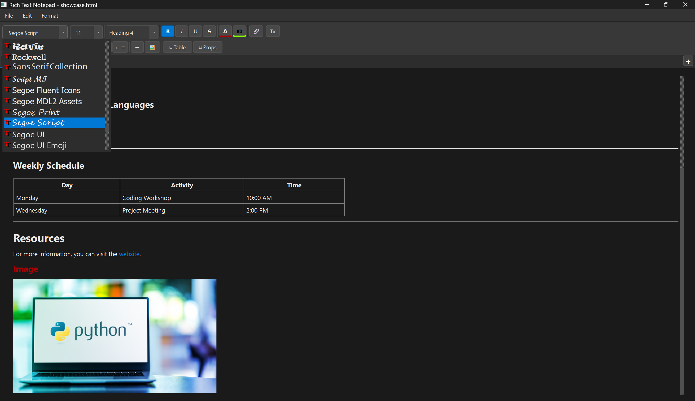
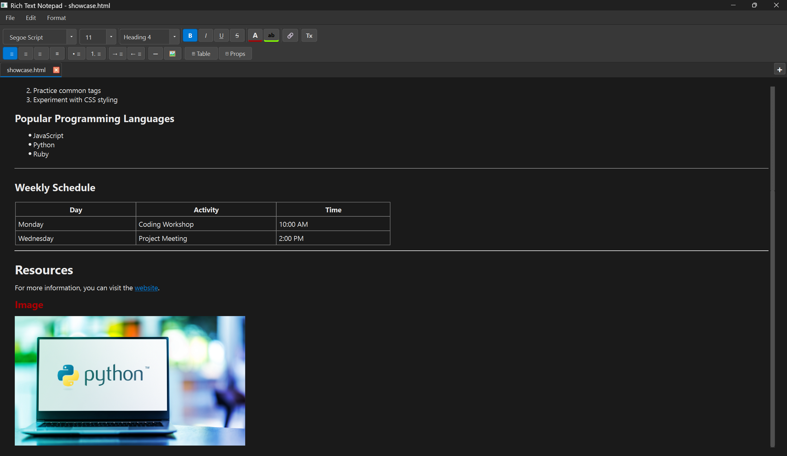

# NoteApp

A modular, desktop rich-text editor built with Python and PyQt6, designed to explore how real-world document editors manage state, formatting, and user interaction.

---

## Video Showcase

https://github.com/user-attachments/assets/1527588c-eb6e-4ff5-95ea-7a55aedc036c

## Screenshots







---

## Overview

NoteApp is a feature-rich desktop editor that supports multi-document workflows, structured content (tables, images), and persistent sessions.

The goal of this project was not just to replicate common editor features, but to **design a system that handles document state, formatting consistency, and user interaction at scale**.

---

## Architecture

The application is structured around separation of concerns between UI, document state, and persistence:

- **UI Layer (MainWindow / Widgets)**
  - Handles layout, toolbars, and user interactions
  - Dispatches actions to the editor and document logic

- **Editor / Document Layer**
  - Manages text state, cursor behavior, and formatting operations
  - Encapsulates each document per tab for isolation

- **Persistence Layer**
  - Handles saving/loading documents (HTML and TXT)
  - Ensures formatting is preserved across sessions

- **Session Manager**
  - Stores open tabs and restores them on launch
  - Maintains continuity across application restarts

---

## Key Technical Decisions

- **HTML as storage format**
  - Chosen to preserve rich text, images, and structure without designing a custom format

- **Multi-tab document model**
  - Each tab maintains independent state to avoid cross-document interference

- **Local-first design**
  - No external dependencies or cloud integration, which ensures performance and reliability

- **PyQt6 for UI**
  - Enables fine-grained control over desktop interactions and complex widgets

---

## Challenges & Solutions

- **Rich text consistency**
  - Managing overlapping styles (bold, headings, colors) without conflicts required careful formatting control

- **Dynamic table manipulation**
  - Supporting row/column updates and styling without breaking layout integrity

- **Session persistence**
  - Ensuring tabs, file paths, and UI state are safely restored across launches

- **State synchronization**
  - Keeping UI indicators (e.g., unsaved ●) consistent with actual document changes

---

## Features (Selected)

### Document System
- Multi-tab editing with drag reordering
- Session recovery on restart
- HTML and plain text file support
- Drag & drop file opening

### Editing & Formatting
- Rich text styling (headings, inline formatting, colors)
- Lists, indentation, and alignment controls
- Clear formatting system

### Structured Content
- Fully editable tables (rows, columns, styling)
- Image insertion with resizing and scaling
- Hyperlink creation and editing (Ctrl+Click navigation)

### Navigation & UX
- Find & replace with match tracking
- Status bar (cursor position, word count)
- Keyboard-first workflow across all major actions

---

## System Design

The application is structured as a layered desktop system where user interactions flow from the UI into document logic and persistence.

### High-Level Flow
```
[User Actions]
    ↓
(MainWindow)

[MainWindow (app/main_window.py)]
    ↓
    ├─→ handles keyboard shortcuts
    ├─→ handles menu clicks
    ├─→ handles toolbar buttons
    ├─→ handles drag & drop
    ↓
    ├─→ _setup_ui
    ├─→ _create_menu_bar
    ├─→ _create_formatting_toolbar
    ├─→ _setup_shortcuts
    └─→ _setup_timers
    ↓
    ├─→ owns tab list
    ├─→ wires signals
    └─→ drives UI state
    ↓
    ↓
    ├───────────────┬────────────────┬────────────────┬────────────────┐
    ↓               ↓                ↓                ↓
[models/]     [services/]       [widgets/]        [config/]
    ↓               ↓                ↓                ↓
    │               │                │                │
    │               │                │                └─→ constants (AppConfig, StyleSheet)
    │               │                │
    │               │                └─→ SearchBar, StatusBarWidget,
    │               │                     TablePropertiesDialog,
    │               │                     TextOrientationDialog
    │               │
    │               └─→ FileOperations (read/write/delete),
    │                    SettingsManager, geometry, recent files
    │
    └─→ Document state, DocumentTab,
         LinkAwareTextEdit,
         is_modified, mark_saved,
         get_content_html

(models/services/widgets/config all interact with ↓)

[Qt Document (in‑memory)]
    ↓
    ├─→ QTextDocument
    ├─→ undo/redo stack
    ├─→ rich‑text cursor
    └─→ embedded images

[Filesystem]
    ↑   ↓
    ├─→ .html
    ├─→ .txt
    ├─→ .bak backups
    └─→ UTF‑8 / latin‑1 encoding

[QSettings]
    ↑   ↓
    ├─→ window geometry
    ├─→ open tabs
    └─→ recent files

```
---

## Keyboard Shortcuts

A full list of keyboard shortcuts is available in [SHORTCUTS.md](SHORTCUTS.md).

---

## File Support

- **HTML (.html)** — Full formatting and structure preserved  
- **TXT (.txt)** — Plain text fallback  
- Automatic mode detection on load  

---

## What This Project Demonstrates

- Designing a **stateful desktop application**
- Managing **multiple documents concurrently**
- Handling **structured content (tables, media)**
- Building **persistent systems (session recovery)**
- Creating **responsive and intuitive UI workflows**

---

## Future Improvements

- Plugin system for extensibility  
- Performance optimization for large documents  
- Refactor more toward MVC/MVVM architecture  
- Unit and integration testing for core logic  
- Export options (e.g., PDF)

---

## Installation

### Requirements
- Python 3.10+
- PyQt6

### Setup
```bash
git clone https://github.com/DerYokoya/NoteApp.git
cd NoteApp
pip install -r requirements.txt
python main.py
