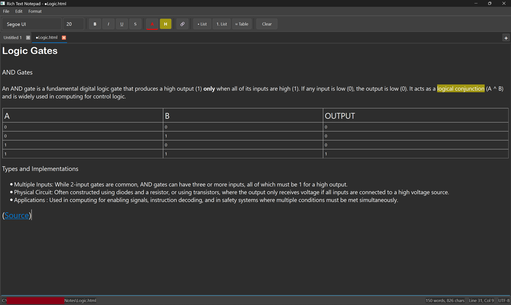
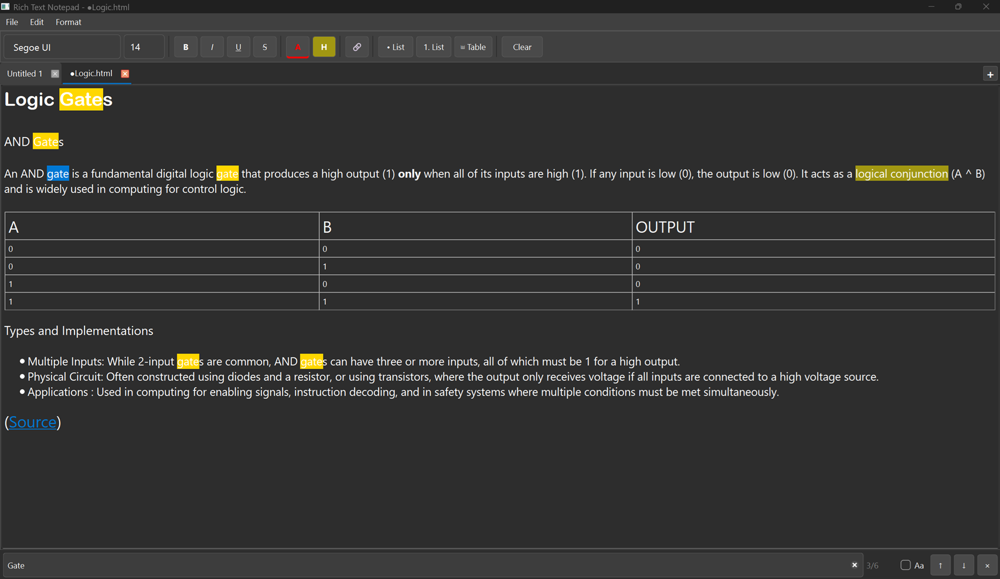

# NoteApp

A lightweight, fast desktop note-taking application built with Python and PyQt6.

Designed for distraction-free writing with tabs, instant search, and local file storage.

## Features
- 📝 Create, edit, and manage notes
- 🗂 Tab-based document system
- 🔍 Fast in-app search
- 💾 Local file persistence
- ⚙️ Persistent user settings
- 🧪 Unit-tested core logic

## Screenshots



## Installation

### Requirements
- Python 3.10+
- PyQt6

### Setup
```bash
git clone https://github.com/DerYokoya/NoteApp.git
cd NoteApp
pip install -r requirements.txt
python main.py